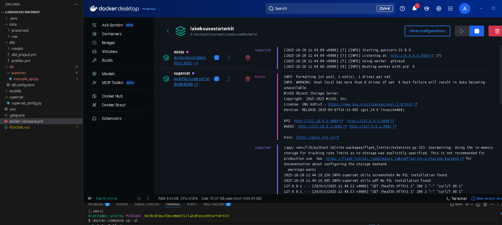

# 🧩 Open Lakehouse Starter



Open source environment for small teams & startups, modelled to be:
- **light**,
- **expandable**,
- **scalable (S3, Spark, orchestrators, Databricks, etc.)**.

## Structure
- `dlt/`: Python ETL pipeline for data ingestion
- `dbt/`: SQL models and transformations
- `superset/`: dashboard & visualizations
- `minio`: S3-compatible object storage

## Prerequisites
- Docker and Docker Compose
- Python 3.9 or higher
- pip (Python package manager)

## Installation

### 1. Clone the repository
```bash
git clone <your-repo-url>
cd LakehouseStarterKit
```

### 2. Create and activate a virtual environment
```bash
python -m venv .venv
# On Windows:
.venv\Scripts\activate
# On Linux/Mac:
source .venv/bin/activate
```

### 3. Install Python dependencies
```bash
pip install -r requirements.txt
```

### 4. Start Docker services
```bash
docker-compose up -d
```

This will start:
- **MinIO** on http://localhost:9001 (console) and http://localhost:9000 (API)
  - Username: `admin`
  - Password: `password123`
- **Superset** on http://localhost:8088
  - Username: `admin`
  - Password: `admin`

Wait a few minutes for Superset to complete initialization.

## Quick Start

### Run the data pipeline
```bash
# Load data from API to DuckDB using dlt
python dlt/pipelines/example_api.py

# Transform data using dbt
cd dbt
dbt run
```

### Access the tools
- **MinIO Console**: http://localhost:9001
- **Superset Dashboard**: http://localhost:8088

## Project Structure
```
.
├── dlt/                    # Data ingestion with dlt
│   ├── pipelines/
│   │   └── example_api.py  # Example pipeline fetching public APIs data
│   └── dlt.config.toml     # dlt configuration
├── dbt/                    # Data transformation with dbt
│   ├── models/
│   │   └── staging/
│   │       ├── sources.yml        # Source definitions
│   │       ├── schema.yml         # Model documentation
│   │       └── example_model.sql  # Example transformation
│   ├── dbt_project.yml
│   └── profiles.yml
├── superset/               # Superset configuration
│   └── superset_config.py
├── docker-compose.yml      # Docker services definition
├── requirements.txt        # Python dependencies
└── .env                    # Environment variables
```

## Next Steps
- Explore the data in DuckDB at `openlakehouse_demo.duckdb`
- Create your own dlt pipelines in `dlt/pipelines/`
- Add dbt models in `dbt/models/`
- Connect Superset to DuckDB and create dashboards
- Scale up by connecting to S3 (MinIO), adding Spark, or integrating orchestrators

## License
MIT License - see LICENSE file for details
